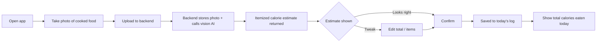
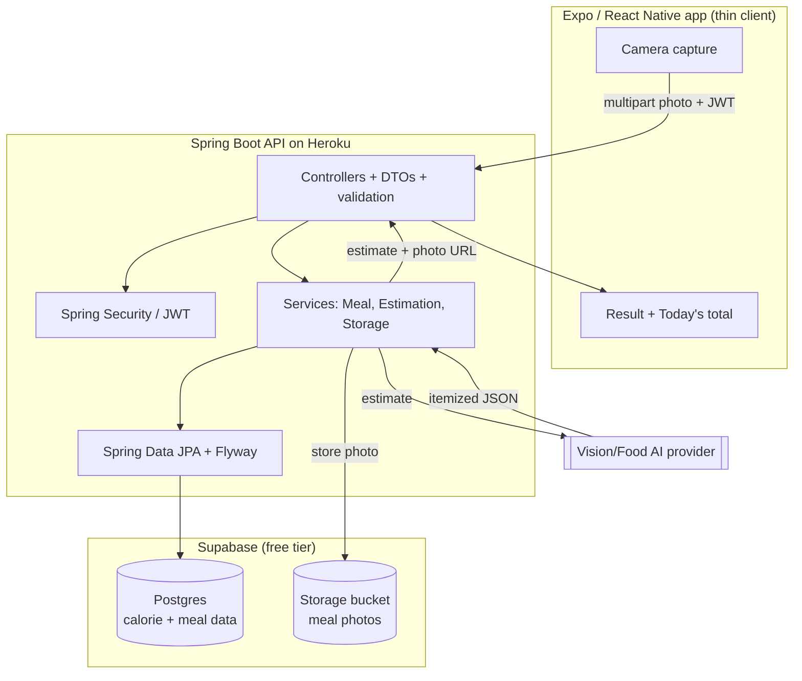
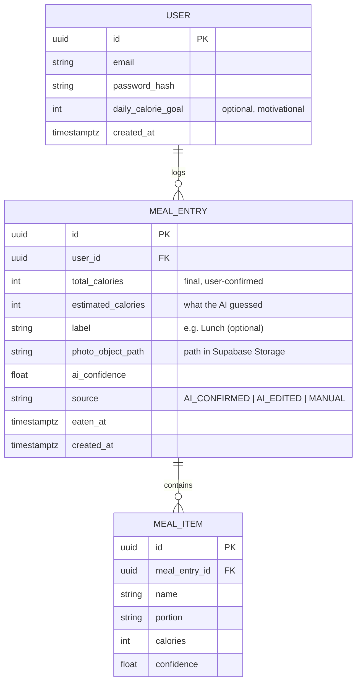

# FitLens — System Design & Product Plan

> Status: Draft for discussion (no implementation yet)
> Goal of this doc: write down what we're building, the real stack/deployment, and the key decisions — before writing code.

---

## 0. Project framing (read this first)

This is a **personal portfolio project for internship applications**, and the author's target role is **backend / server-side**. That decision shapes everything below:

- **The Spring Boot backend is the showcase.** It should demonstrate clean layering, validation, security, persistence + migrations, external-API integration, file/object storage, tests, API docs, and a real cloud deployment.
- **The Expo (React Native) frontend is intentionally thin** — just enough of a real app to demonstrate the backend end to end (take a photo, send it, show the result, show today's total).
- When a choice trades "more impressive backend" against "less frontend work," we lean toward **showing off the backend**.

---

## 1. What we're building (one paragraph)

FitLens is a **personal fitness camera app**. Core loop: the user **takes a photo of the food they cooked → the backend estimates the calories → the result is displayed → the user confirms/edits → it's saved → the app shows total calories eaten today.** V1 is single-user and optimized to feel like a *lightweight fitness journal* — fast, simple, motivating. Later versions add progress photos, sharing with friends, workout tracking, gym-machine recognition, and progress charts.

---

## 2. Product principles

1. **Speed over completeness** — the "photo → estimate → confirm" loop takes seconds.
2. **Confirm, don't configure** — the AI guesses, the user nudges. No barcode/macro spreadsheets in V1.
3. **Thin client, strong server** — business logic lives in the backend (portfolio focus + keeps the app simple).
4. **Motivating, not guilt-inducing** — celebrate consistency, not deficits.
5. **Ship one solid loop first** — single-user calorie loop end to end before anything social/workout.

---

## 3. Tech stack (final)

| Layer | Choice | Notes |
|------|--------|-------|
| **Mobile client** | **Expo / React Native** | Cross-platform, fast to build, run in Expo Go for dev. Kept deliberately thin. |
| **Backend** | **Spring Boot 4.1 / Java** | The portfolio centerpiece. (Pin an **LTS Java — 25 or 21 — for Heroku**, not 26; see §11.) |
| **Database** | **Supabase Postgres (free tier)** | Spring Data JPA + **Flyway** migrations. Connect via the **pooler** (see §11). |
| **Object storage** | **Supabase Storage bucket (free tier)** | Stores meal photos. Backend mediates uploads. |
| **Calorie estimation** | **Vision LLM/food API behind an adapter** | Backend calls it; pluggable interface (see §6). |
| **Backend hosting** | **Heroku** (Eco dyno) | Note cold starts + no true free tier (see §11). |
| **Auth** | **JWT issued by the Spring backend** | Implementing this ourselves showcases Spring Security (see §8). |
| **API docs** | **springdoc-openapi (Swagger UI)** | Free, instant, great for a portfolio reviewer. |

---

## 4. Core user flow (V1)

Emotional target: open → shoot → glance → tap → done.

---

## 5. System architecture

**Backend is the orchestrator on purpose:** the client just sends a photo and renders what comes back. The backend stores the image in Supabase Storage, calls the vision provider, persists the result in Supabase Postgres, and returns a clean DTO. This is what makes the project read as a *backend* project.

---

## 6. The key decision: calorie estimation (pluggable adapter)

Calorie estimation from a photo is the core magic, and the only real architectural fork.

**Recommendation:** the backend exposes an `EstimationProvider` interface and ships one implementation that calls a **multimodal vision model** (GPT-4o-class or Gemini-Flash-class). Swappable later for a dedicated food API (Nutritionix, LogMeal, Passio) or, much later, an on-device model — without touching the rest of the system.

What the provider returns (so the edit screen can render it directly):
- `items[]` — each with `name`, `portion`, `calories`, `confidence`
- `totalCalories`
- overall `confidence` (so the UI can say "not sure, please check")

Itemization makes editing fast: fix one wrong item instead of re-typing the whole number.

**Backend resilience to show off here:** request timeouts, a retry with backoff, and a graceful fallback to **manual entry** if the provider is slow/unavailable. The vision API key lives in Heroku config vars, never in the client.

---

## 7. Photo storage & the privacy note

The earlier draft kept photos strictly on the phone. With a **Supabase Storage bucket** in the stack, the V1 design instead **stores the meal photo in the bucket** — which is the better choice here because:
- it demonstrates **file upload handling, object storage, and signed URLs** (valuable backend skills for a portfolio), and
- it lets the dashboard show real thumbnails from any device.

**Upload pattern (backend-mediated, V1):** the client posts the image to the backend; the backend uploads it to Supabase Storage and persists only the **object path** in Postgres, serving images later via **short-lived signed URLs**. (A more advanced variation — backend mints a signed upload URL and the client uploads directly to Supabase — is a nice P2 enhancement to mention in interviews.)

**Tradeoff to be explicit about:** this moves photos to the cloud, so the "photo never leaves your phone" promise from the first draft no longer holds. For a personal/portfolio app that's fine; if strict privacy is wanted later, add an "on-device only" mode. **Decision needed (§14).**

---

## 8. Auth

Implement **JWT auth in the Spring backend** (email/password register + login → signed JWT; stateless `SecurityFilterChain`; per-user data isolation). Rolling this ourselves is deliberate — it showcases Spring Security, which a backend reviewer cares about.

- For a true single-user MVP you *could* hardcode one user, but JWT register/login reads far better in a portfolio and unlocks multi-user later.
- Alternative considered: **Supabase Auth**. Rejected for V1 because validating Supabase-issued JWTs in Spring adds glue without showcasing *our* backend skills — though it's a legitimate option to mention.

---

## 9. Data model (V1)

Designed so future phases (workouts, social, progress photos) extend it without reshaping the core.

Notes:
- Keeping both `estimated_calories` and `total_calories` lets us measure "how often does the user correct the AI" — good for honest confidence UX and a nice talking point.
- "Today's total" is a cheap aggregate query at single-user scale; no summary table needed in V1.
- All schema changes go through **Flyway migrations** (already a dependency) — versioned, repeatable, demo-friendly.

---

## 10. API design (V1 sketch)

| Method | Path | Purpose |
|-------|------|---------|
| `POST` | `/auth/register` | Create account → JWT |
| `POST` | `/auth/login` | Email/password → JWT |
| `POST` | `/meals/estimate` | Upload photo (multipart) → store in bucket + return itemized estimate (not yet saved) |
| `POST` | `/meals` | Save the confirmed/edited entry |
| `GET` | `/meals?day=YYYY-MM-DD` | List a day's entries (with signed photo URLs) |
| `PATCH` | `/meals/{id}` | Edit a saved entry |
| `DELETE` | `/meals/{id}` | Remove an entry |
| `GET` | `/dashboard/today` | Today's total + entries (the V1 headline screen) |
| `GET` | `/actuator/health` | Health check (Heroku/uptime) |

Clean separation: **`/estimate`** (photo in → numbers out) vs **`/meals`** (persist the confirmed result). Every endpoint uses **DTOs + bean validation**, with a central `@RestControllerAdvice` for consistent error responses.

---

## 11. Deployment topology (Heroku + Supabase) — the operational details

These specifics are exactly what make a backend portfolio look real:

**Heroku (Spring Boot):**
- Build the Spring Boot jar; run with `--server.port=$PORT` (Heroku assigns the port).
- **Pin an LTS Java runtime (25 or 21)** via `system.properties` — Heroku's buildpack lags new releases, so Java 26 is risky. (Spring Boot 4.x needs Java 17+.)
- **No true free tier:** Eco dynos (~$5/mo, shared hours) are cheapest; they **sleep after 30 min idle → cold starts (~10–20s on first hit).** Acceptable for a demo; mention it.
- All secrets (DB URL, vision API key, JWT secret) live in **Heroku config vars**, never in the repo.

**Supabase (Postgres + Storage):**
- Connect Spring via the **Supavisor pooler** (transaction mode, port `6543`), and keep the **Hikari pool small** (e.g. 2–5) — free-tier connection limits + a dyno don't tolerate large pools.
- Free-tier projects **pause after ~1 week of inactivity** — a quick gotcha when demoing months later (just unpause).
- Storage bucket holds meal photos; access via signed URLs.

**Suggested CI/CD (portfolio gold):** GitHub Actions → run tests (incl. Testcontainers) → deploy to Heroku on green `main`.

---

## 12. The "open it without a laptop / no QR" question

Important clarification: **Expo Go is the development client** — it loads your JS bundle from a source (your laptop's Metro server via QR, or a published update). It is great while building, but it isn't the right tool for "tap an installed app and it just works forever."

To get a real, tappable, standalone app that runs against your Heroku backend with **no laptop and no QR scanning**:

- **Use EAS Build (preview/standalone build).**
  - **Android: free** — EAS produces an installable **APK** you sideload once; opens like any app, hits Heroku directly.
  - **iOS: needs a paid Apple Developer account ($99/yr)** for a standalone/TestFlight build. Running on a real iPhone without that is limited.
- **EAS Update** can then push JS-only over-the-air updates to that installed build (no rebuild for pure-JS changes).
- **Expo Go** stays as your fast inner-dev-loop tool (scan QR while iterating on a laptop).

**Recommendation:** develop in Expo Go; for the "install once, open anytime" experience you described, ship a **preview EAS Build** — and since iOS standalone costs money, **Android APK is the free path** for a personal project. **Decision needed (§14).**

---

## 13. What to deliberately showcase in the backend (for reviewers)

A checklist that turns this from "a CRUD app" into "a backend they want to hire":
- **Layered architecture:** Controller → Service → Repository, with DTOs + mappers (no entities leaking out of the API).
- **Validation + central error handling** (`@Valid`, `@RestControllerAdvice`, consistent error JSON).
- **Spring Security + JWT**, stateless, per-user authorization.
- **Flyway migrations** (versioned schema).
- **External API integration done well** (timeouts, retry/backoff, fallback, key management).
- **Object storage integration** (Supabase Storage, signed URLs).
- **Tests:** unit (Mockito) + integration (`@SpringBootTest`, **Testcontainers** Postgres) + a mocked vision API (MockWebServer).
- **OpenAPI/Swagger docs.**
- **Cloud deploy + CI/CD** (Heroku + GitHub Actions).
- A clean **README** with architecture diagram, run instructions, and the design decisions from this doc.

---

## 14. Open questions / decisions I need from you

1. **Estimation provider:** general vision LLM (flexible, recommended) vs. a dedicated food-nutrition API? Any budget ceiling per estimate (or a free/dev tier you prefer)?
2. **Photo storage:** confirm we're storing photos in **Supabase Storage** (my updated recommendation) vs. reverting to on-device-only (and dropping the bucket from V1)?
3. **Target platform for the standalone build:** **Android APK (free)** vs. iOS (needs paid Apple account)? This decides the §12 path.
4. **Auth:** roll our own **Spring JWT** (recommended, shows skill) vs. **Supabase Auth** (less to build)?
5. **Java version for deploy:** OK to pin to **LTS 25 (or 21)** instead of 26 for Heroku reliability?
6. **Daily goal:** include an optional motivational goal in V1, or leave it out to keep the loop minimal?

---

## 15. Suggested next steps (after §14 is answered)

1. Lock V1 scope + answer §14.
2. Pin the Java runtime; add `system.properties` + `Procfile`; wire Supabase Postgres via the pooler; confirm app boots on Heroku with `/actuator/health`.
3. **Flyway migration** for `USER`, `MEAL_ENTRY`, `MEAL_ITEM`.
4. Auth endpoints (`/auth/register`, `/auth/login`) + JWT security.
5. `EstimationProvider` interface + one vision implementation; `/meals/estimate` (store photo in bucket + return estimate).
6. `POST /meals` + `GET /dashboard/today`.
7. Add Swagger, tests (Testcontainers + mocked vision), and GitHub Actions → Heroku.
8. Thin Expo app: camera → upload → show estimate → confirm → show today's total. Ship a **preview EAS Build** to use it without a laptop.

---

### TL;DR
A **backend-first portfolio project**: thin **Expo** client, strong **Spring Boot** API on **Heroku**, **Supabase** for Postgres + photo storage. V1 = *photo of your cooked food → backend estimates calories → confirm → see today's total*. Make **estimation a swappable adapter**, **store photos in Supabase Storage**, secure it with **our own JWT**, and prove it with **tests + Swagger + CI/CD**. For "open it without a laptop," ship a **preview EAS Build** (Android APK is the free path). Pin **LTS Java**, use the **Supabase pooler**, and expect **Eco dyno cold starts**.
